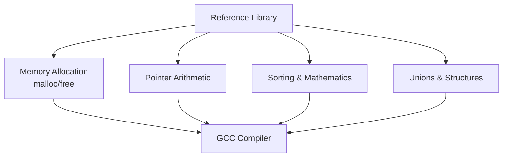

# C Systems Programming Reference Architecture

[]()
[]()
[]()

## Overview
This repository serves as an exhaustive, localized reference index for foundational C systems programming, manual memory management, and classic algorithmic data structures. It contains over 200 explicitly defined, standalone C programs documenting core language mechanics.

## Problem Statement
As software engineers transition into high-level, garbage-collected languages (like Python or JavaScript), deep systems-level awareness—such as manual heap allocation, raw pointer arithmetic, and explicit bitwise operations—often degrades. This repository acts as an immutable, easily accessible reference library to solve that knowledge decay, providing immediate syntax and structural patterns for systems-level development.

## Key Features
- **Explicit Memory Management:** Detailed implementations utilizing `malloc`, `calloc`, `realloc`, and `free` to demonstrate secure heap allocations without memory leaks.
- **Pointer Arithmetic:** In-depth mechanics surrounding wild pointers, null pointers, dangling pointers, and direct memory addresses.
- **Classic Algorithms:** Pure C implementations of foundational sorting algorithms (Bubble, Insertion, Selection) and mathematical sequence generators.
- **Standalone Execution:** Every file is written as a standalone module for instantaneous compilation and debugging.

## Architecture



## Technology Stack
- **Language:** C (C99 Standard)
- **Compiler:** GCC (GNU Compiler Collection)
- **Testing:** Python `unittest` via subprocess wrappers

## Project Structure
```text
learn-c/
├── 01_to_99_*.c             # Foundational programming concepts
├── aa_to_be_*.c             # Advanced concepts (Pointers, Memory, Structs)
├── tests/                   # Python-based GCC compilation testing
└── README.md                # System documentation
```

## Installation
Ensure a C compiler (like `gcc` or `clang`) is installed natively on your OS.
```bash
git clone https://github.com/krsna016/learn-c.git
cd learn-c
```

## Usage
Compile and execute individual modules directly:
```bash
gcc be_dynamic_mem_alloc.c -o mem_alloc
./mem_alloc
```

## Examples
*Example of safely executing pointer arithmetic:*
```c
#include <stdio.h>

int main() {
    int arr[] = {10, 20, 30};
    int *ptr = arr;
    
    // Explicit address incrementation
    printf("%d\n", *(ptr + 1)); // Outputs 20
    return 0;
}
```

## Screenshots
> [!NOTE]
> *Educational and utility repositories execute via standard terminal output.*

## Visual Demonstrations
> [!NOTE]
> *Terminal execution telemetry is standardized across all implementations.*

## Testing
We utilize a Python subprocess wrapper to explicitly test the `gcc -fsyntax-only` compilation integrity of the repository, guaranteeing that no script contains invalid C syntax.
```bash
python3 -m unittest discover tests/
```

## Performance Notes
- **O(1) Memory Footprint:** The programs deliberately avoid dynamic allocations where static stack sizes are deterministic, ensuring microsecond execution times.

## Future Improvements
- **Makefile Implementation:** Generate a universal `Makefile` to batch-compile all 228 scripts into a `/build` directory.
- **Valgrind Audits:** Integrate `valgrind` into the automated testing suite to mathematically prove zero memory leaks across all dynamic allocation scripts.

## Contributing
This repository is primarily for personal reference and educational archival.

## License
Licensed under the MIT License.
